# Creating a simple publisher and subscriber using both C++ and Python

- Nodes are executable processes that communicate over the ROS graph. 
- In this tutorial, the nodes will pass information in the form of string messages to each other over a topic.
- The example used here is simple talker and listener. One node publishes data and the other node subscribes to the topic so it can recieve the data.

## Creating using C++

- Create a package first using 

`ros2 pkg create --build-type ament_cmake --license Apache-2.0 cpp_pubsub` 
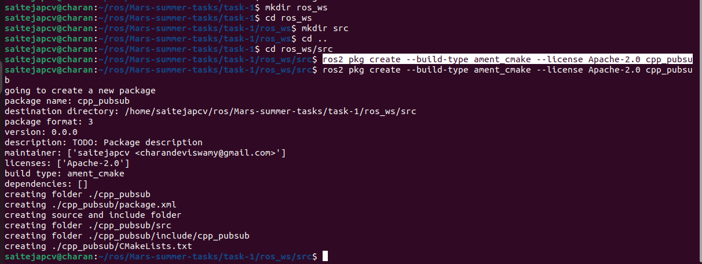
in a workspace as mentioned in the [clietLibraries file](clientLibraries.md).

### Write the publisher node

Download the example talker code in the directory `ros2_ws/src/cpp_pubsub/src` by entering the following command:

`wget -O publisher_member_function.cpp https://raw.githubusercontent.com/ros2/examples/humble/rclcpp/topics/minimal_publisher/member_function.cpp`

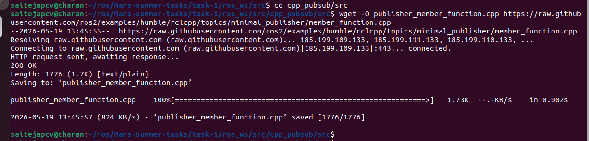
Now you will have a file named `publisher_member_function.cpp`. Open it using preffered Text Editor.
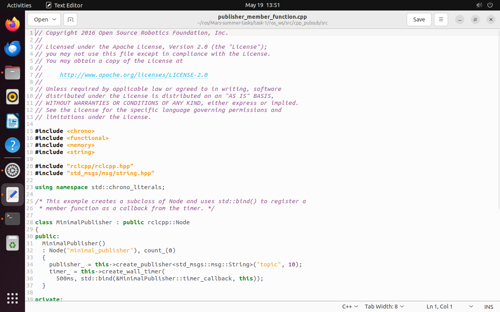
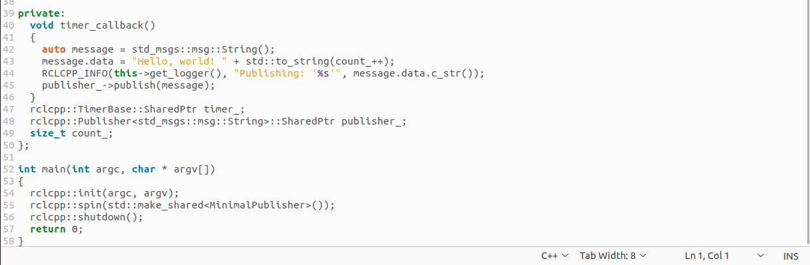

You will see the C++ Code here.

#### Examine the code

- Top of the code includes the standard C++ libraries.
- After that there is `rclcpp/rclcpp.hpp` include which allows you to use the most common pieces of the ROS 2 system.
- Last is `std_msgs/msg/string.hpp`, which includes the built-in message type you will use to publish data.

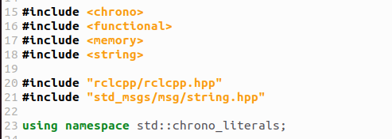

- These lines represent node dependencies. 
- The next line creates the node class `MinimalPublisher` by inheriting from `rclcpp::Node`. 
- Every `this` in the code is referring to the node.

- The public constructor names the node `minimal_publisher` and initializes `count_` to 0.
- Inside the constructor, the publisher is initialized with the `String` message type, the topic name `topic`, and the required queue size to limit messages in the event of a backup. 
- Next, `timer_` is initialized, which causes the `timer_callback` function to be executed twice a second.

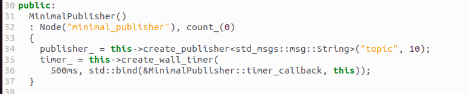

- The `timer_callback` function is where the message data is set and the messages are actually published. 
- The RCLCPP_INFO macro ensures every published message is printed to the console.

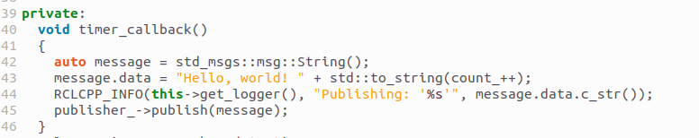

- Last is the declaration of the timer, publisher, and counter fields.

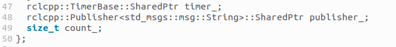

- Following the `MinimalPublisher` class is `main`, where the node actually executes. 
- `rclcpp::init` initializes ROS 2, and `rclcpp::spin` starts processing data from the node, including callbacks from the timer.

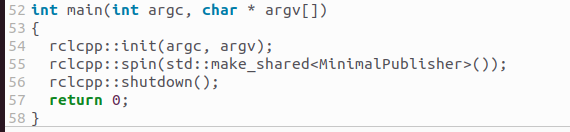

#### Add Dependencies

- As I mentioned earlier we need to add our dependencies in `package.xml`.
- In this file add dependencies in a new line after the `ament_cmake` buildtool dependency.

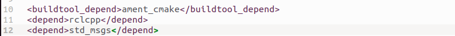

- This declares the package needs `rclcpp` and `std_msgs` when its code is built and executed.

#### CMakeLists.txt

- We need to add the dependencies here too. 
- To add these open the `CMakeLists.txt` file. Below the existing dependency `find_package(ament_cmake REQUIRED)`, add the lines:

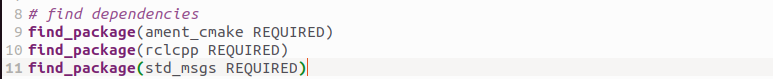

- After that, add the executable and name it `talker` so you can run your node using `ros2 run`:

- Finally, add the `install(TARGETS...)` section so `ros2 run` can find your executable:

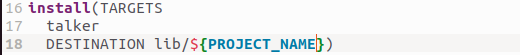

- You can clean up your `CMakeLists.txt` by removing some unnecessary sections and comments, so it looks like this:

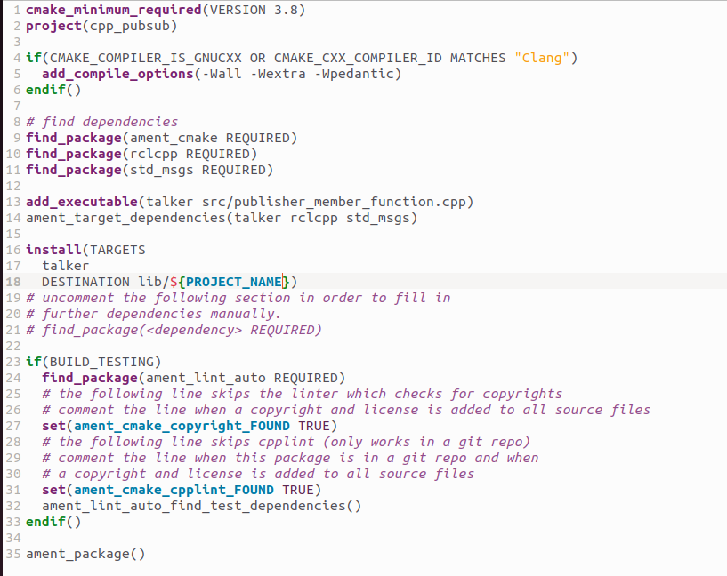

### Write the subscriber node

Download the example listener code in the same package by entering the following command:

`wget -O subscriber_member_function.cpp https://raw.githubusercontent.com/ros2/examples/humble/rclcpp/topics/minimal_subscriber/member_function.cpp`

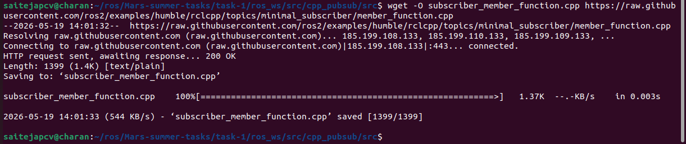

Now you will have a file named `subscriber_member_function.cpp`. Open it using preffered Text Editor.

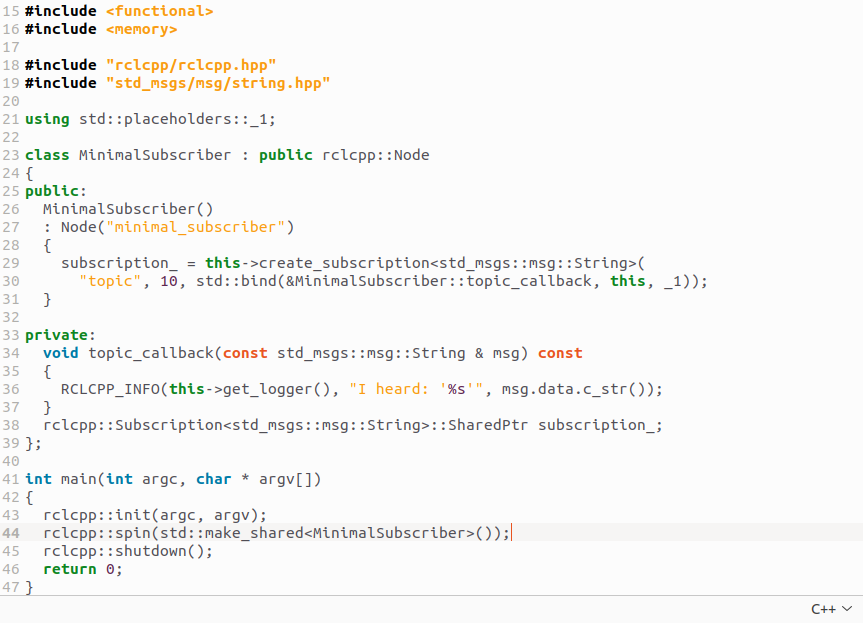

You will see the C++ Code here.

#### Examine the code

- The subscriber node is similar to publisher node.
- Now the node is named `minimal_subscriber`, and the constructor uses the node’s create_subscription class to execute the callback.

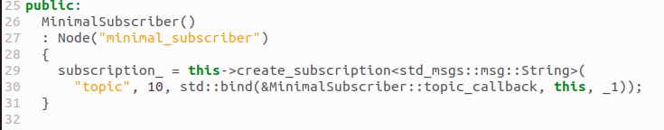

- The `topic_callback` function receives the string message data published over the topic, and simply writes it to the console using the `RCLCPP_INFO` macro.

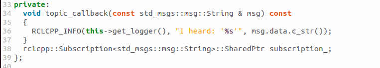

- The `main` function is exactly the same, except now it spins the `MinimalSubscriber` node.
 For the publisher node, spinning meant starting the timer, but for the subscriber it simply means preparing to receive messages whenever they come.

- Since this node has the same dependencies as the publisher node, there’s nothing new to add to `package.xml`.

#### CMakeLists.txt

- Open `CMakeLists.txt` and add the executable and target for the subscriber node below the publisher’s entries.

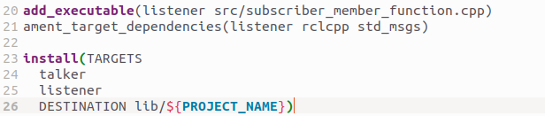

### Build and Run

- It’s good practice to run rosdep in the root of your workspace (ros2_ws) to check for missing dependencies before building:

`rosdep install -i --from-path src --rosdistro humble -y`

- Now in the root of the workspace build you package with following command.

`colcon build --packages-select cpp_pubsub`

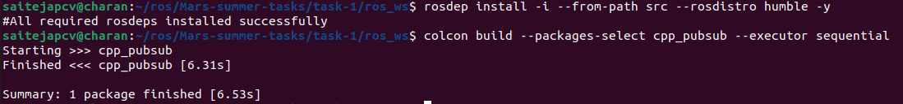

- Now open a new terminal, navigate to workspace and source the setup files.

`. install/setup.bash`

- Now run talker and listener nodes you will see the talker publishing and listener hearing every 0.5 sec

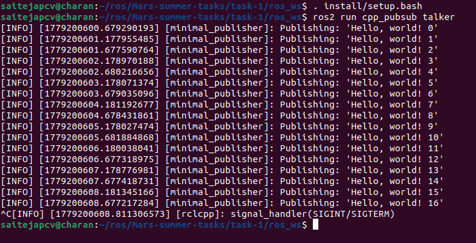

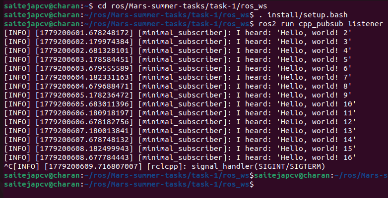

- You can end it by using Ctrl-C

## Creating using Python

- Create a package first using 

`ros2 pkg create --build-type ament_python --license Apache-2.0 py_pubsub`

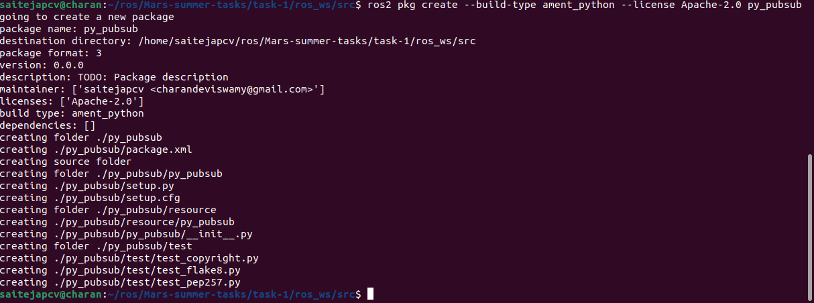 

in a workspace as mentioned in the [clietLibraries file](clientLibraries.md).

### Write a publisher Node

- Download the example talker code in the directory `ros2_ws/src/py_pubsub/py_pubsub` by entering the following command:

`wget https://raw.githubusercontent.com/ros2/examples/humble/rclpy/topics/minimal_publisher/examples_rclpy_minimal_publisher/publisher_member_function.py`

Now you will have a file named `publisher_member_function.py` adjacent to `__init__.py`. Open it using preffered Text Editor.

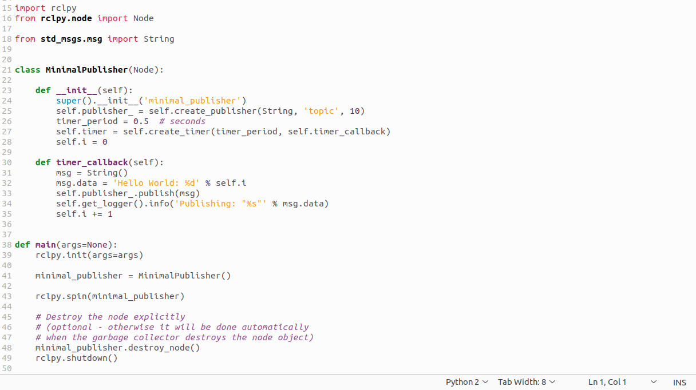

You will see the Python Code here.

#### Examine the code

- The first lines of code after the comments import rclpy so its Node class can be used.

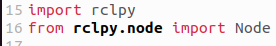

- The next statement imports the built-in std_msgs/msg/String message type that the node uses to structure the data that it passes on the topic.

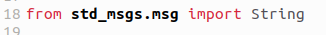

- These lines represent the node’s dependencies.
- Next the `MinimalPublisher` class is created, which inherits from (or is a subclass of) Node.

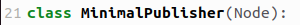

- Following is the definition of the class’s constructor. super().__init__ calls the Node class’s constructor and gives it your node name, in this case minimal_publisher.
- create_publisher declares that the node publishes messages of type std_msgs/msg/String, over a topic named `topic`, and that the “queue size” is 10. 
- Queue size is a required Quality of Service (QoS) setting that limits the amount of queued messages if a subscriber is not receiving them fast enough.
- Next, create_timer is used to create a callback that executes every 0.5 seconds. `self.i` is a counter used in the callback.

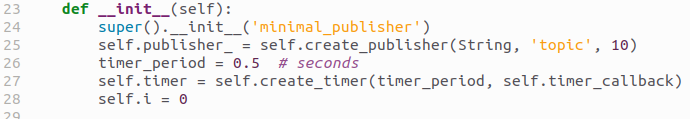

- `timer_callback` creates a message with the counter value appended, publishes it, and prints it to the console with get_logger()’s info() function.

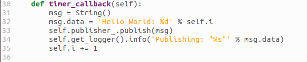

- Lastly, the main function is defined.

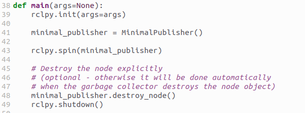

- First the rclpy library is initialized, then the node is created, and then it “spins” the node (using spin()) so its callbacks are called.

#### Add dependencies

- As I mentioned earlier we need to add our dependencies in `package.xml`.
- In this file add dependencies in a new line after `</lisense>` tag.

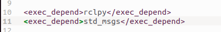

- This declares the package needs `rclcpp` and `std_msgs` when its code is built and executed.

#### Add starting point

- Open the setup.py file. Again, match the maintainer, maintainer_email, description and license fields to your package.xml

- Add the following line within the console_scripts brackets of the entry_points field:

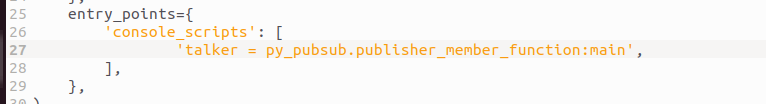

#### Checkup setup.cfg

- The contents of the setup.cfg file should be correctly populated automatically, like so:

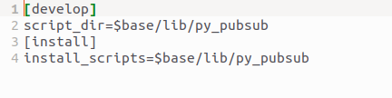

- This is simply telling setuptools to put your executables in lib, because ros2 run will look for them there.

### Writing a Subscriber node

- Go to `ros2_ws/src/py_pubsub/py_pubsub` and download the subscriber node code by:

`wget https://raw.githubusercontent.com/ros2/examples/humble/rclpy/topics/minimal_subscriber/examples_rclpy_minimal_subscriber/subscriber_member_function.py`

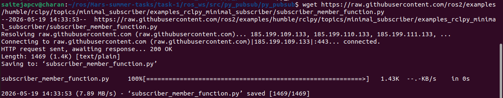

#### Examine the code

- You can see the python code by openin the `subscriber_member_function.py` with your text editor.
- The subscriber node’s code is nearly identical to the publisher’s. The constructor creates a subscriber with the same arguments as the publisher using create_subscription.

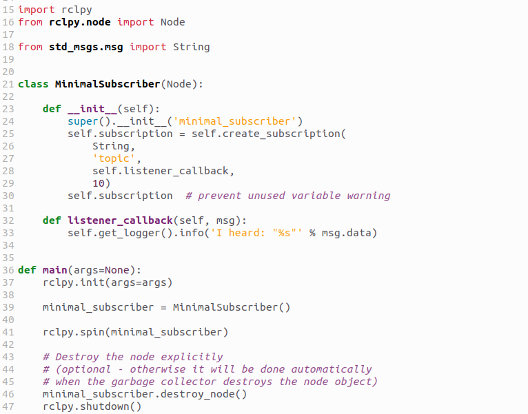

- Topic name and message type used by the publisher and subscriber must match to allow them to communicate.

- The subscriber’s constructor and callback don’t include any timer definition, because it doesn’t need one. Its callback gets called as soon as it receives a message.
- The callback definition simply prints an info message to the console, along with the data it received. Recall that the publisher defines msg.data = 'Hello World: %d' % self.i

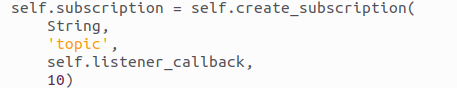

- The `main` definition is almost exactly the same, replacing the creation and spinning of the publisher with the subscriber.

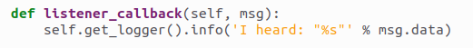

- Since this node has the same dependencies as the publisher, there’s nothing new to add to package.xml. The setup.cfg file can also remain untouched.

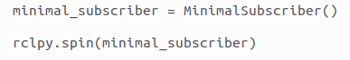

#### Add an entry point

- Again open setup.py. Add an entry point there which looks like:

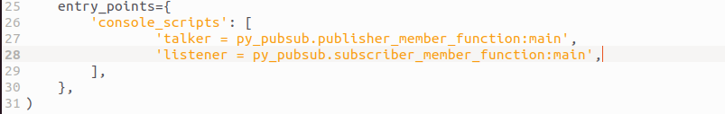

### Build and run

- It’s good practice to run rosdep in the root of your workspace (`ros2_ws`) to check for missing dependencies before building:

`rosdep install -i --from-path src --rosdistro humble -y`

- Now in you workspace build the package using 

`colcon build --packages-select py_pubsub`

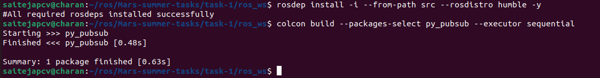

- In a new terminal source your setup files in the workspace

`source install/setup.bash`

- Now run talker and listener nodes you will see the talker publishing and listener hearing every 0.5 sec

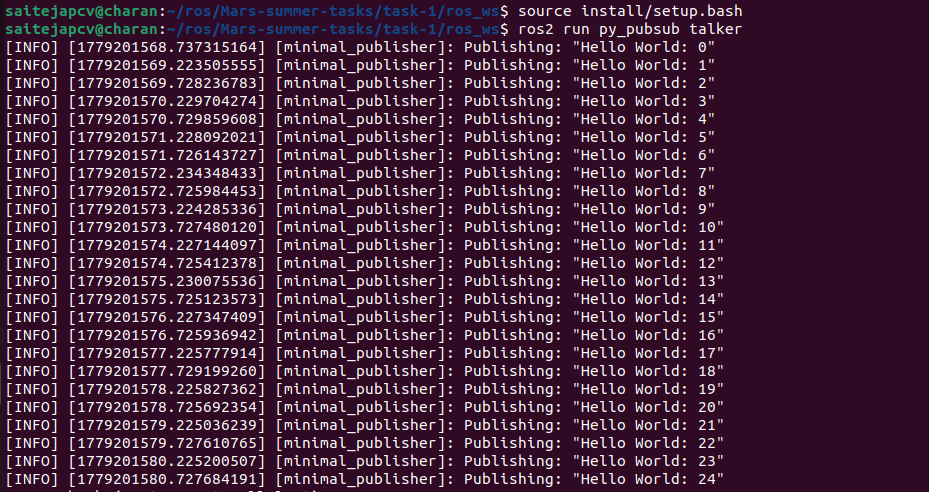

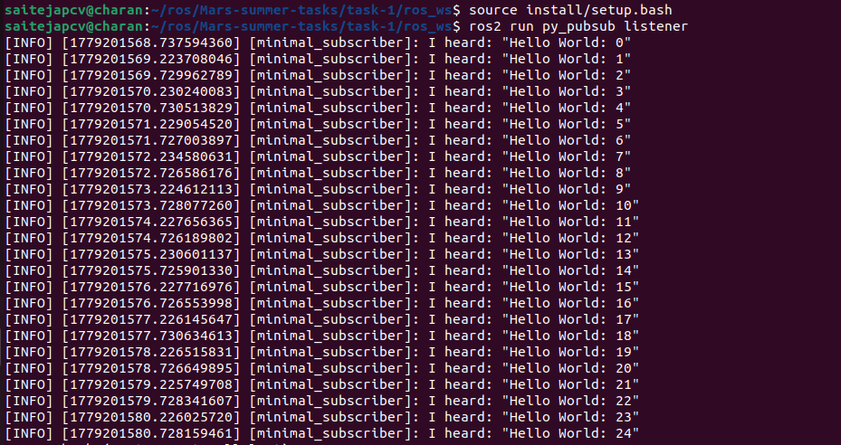
- You can end it by using Ctrl-C.
