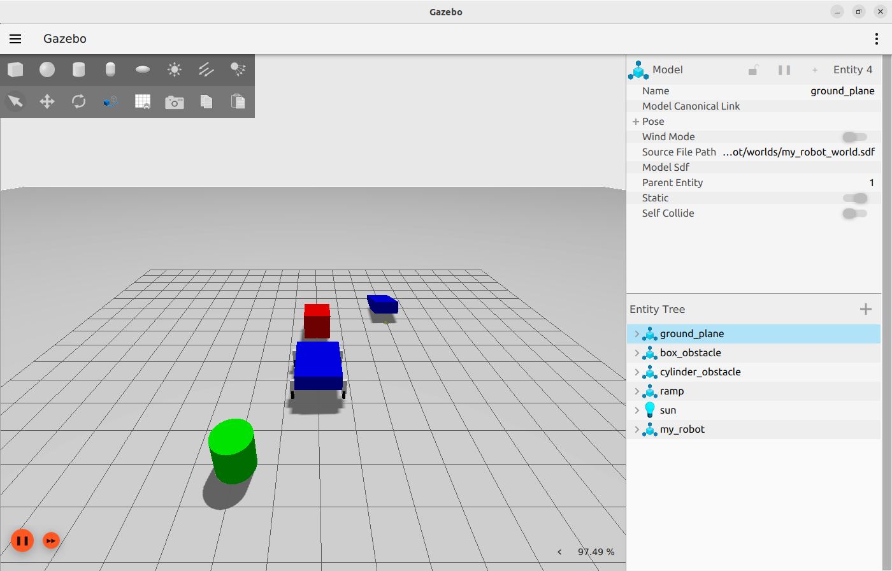
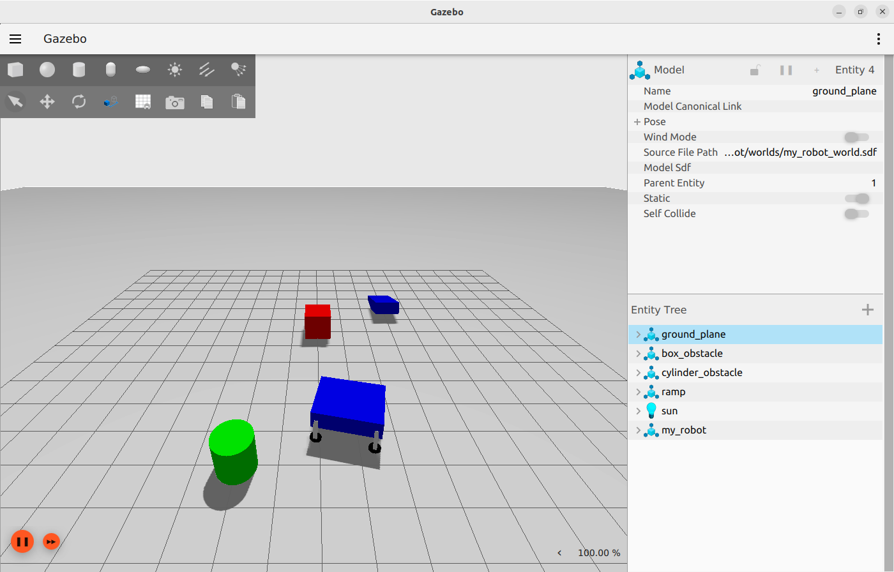
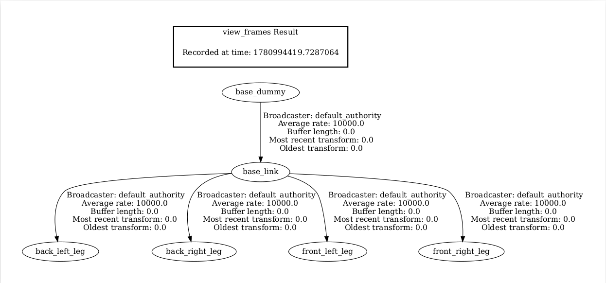

# Task - 3

- I have created a rover using urdf. [my_robot.urdf](../ros_ws/src/my_robot/urdf/my_robot.urdf). Its explaination [my_robot.md](my_robot.md)
- I also created a world using sdf file. [my_robot_world.sdf](../ros_ws/src/my_robot/worlds/my_robot_world.sdf). Its explaination [world.md](world.md)
- I have written 2 launch file to create.
  - First one is for creating a world and spawning our rover in gazebo. [gazebo.launch.py](../ros_ws/src/my_robot/launch/gazebo.launch.py). Its explaination [spawn_robot.md](spawn_robot.md).
  - Second one is for visualising the rover in RViz. [rviz.launch.py](../ros_ws/src/my_robot/launch/rviz.launch.py). Its explaination [visualisation.md](visualisation.md).

## Simulation of our robot





## RViz Visualization


## Concepts Learned:

- `URDF`: It stands for *Unified Robot Description Format*. It is an XML-based markup language used in the Robot Operating System (ROS) ecosystem to define the physical and kinematic properties of a robot
- `SDF`: It stands for *Simulation Description Format*. It is an XML-based file format used by the Gazebo simulator to describe environments, objects, and robots.
- `Gazebo`: It is an advanced, open-source 3D robotics simulator used to test robots, drones, and autonomous vehicles in highly realistic virtual environments
- `Xacro`: It is a scripting and macro language used primarily in the Robot Operating System (ROS) to simplify, organize, and parameterize robot descriptions (URDF files)
- `Robot State Publisher`: It is a node and a class to publish the state of a robot to tf2. At startup time, Robot State Publisher is supplied with a kinematic tree model (URDF) of the robot. It then subscribes to the joint_states topic (of type sensor_msgs/msg/JointState) to get individual joint states. These joint states are used to update the kinematic tree model, and the resulting 3D poses are then published to tf2.
- `Joint State Publisher`: It is a node that publishes the states of individual joints. It is subscribed by `Robot State Publisher` to update the Kinematic tree model.
`teleop_twist_keyboard`: It is a a robot-agnostic teleoperation node to convert keyboard commands to Twist messages.
`TF Trees`: tf2 is the transform library, which lets the user keep track of multiple coordinate frames over time. tf2 maintains the relationship between coordinate frames in a tree structure buffered in time and lets the user transform points, vectors, etc. between any two coordinate frames at any desired point in time.
  - You can get a snapshot of your tf tree by using 
  
  ```
  ros2 run tf2_tools view_frames
  ```
  - This will listen to active transforms for 5 sec and generate a structured pdf file. This will create a pdf in the same directory where you have executed the command.

- Our TF Tree looks like this



## Executing the code.

- We can visualise our rover using this process
  1. Build the package using `colcon`.
  2. Open a new terminal and source it.
  3. Now use the following command
  ``` 
  ros2 launch my_robot rviz.launch.py
  ```

- We can simulate our rover using gazebo using this process
  1. Build the package using `colcon`.
  2. Opne a new terminal and source it.
  3. Now use the following command
  ```
  ros2 launch myrobot gazebo.launch.py
  ```

By using these command you can execute the written code and see the rover.

- Now to move the rover you should use `teleop_twist_keyboard`.
  1. While gazebo is running go to another terminal and execute this following command
  ```
  ros2 run teleop_twist_keyboard teleop_twist_keyboard
  ```

- Using the commands shown in the terminal you can move the rover.

### References 

[teleop_twist_keyboard](https://docs.ros.org/en/rolling/p/teleop_twist_keyboard/)||[Tf2](https://docs.ros.org/en/humble/Concepts/Intermediate/About-Tf2.html)||[Introducing tf2](https://docs.ros.org/en/humble/Tutorials/Intermediate/Tf2/Introduction-To-Tf2.html)

[ROS + Gazebo Sim](https://github.com/gazebosim/ros_gz/blob/humble/ros_gz_sim/README.md)||[Bridge communication between ROS and Gazebo](https://github.com/gazebosim/ros_gz/tree/humble/ros_gz_bridge)||[SDF worlds](https://gazebosim.org/docs/fortress/sdf_worlds/)||[SDF Docs](https://sdformat.org/spec/1.8/world/)||[ROS 2 Interoperability](https://gazebosim.org/docs/fortress/ros2_interop/) || [[Robot State Publisher](https://github.com/ros/robot_state_publisher/tree/rolling) || [RViz User Guide](https://docs.ros.org/en/humble/Tutorials/Intermediate/RViz/RViz-User-Guide/RViz-User-Guide.html)||[Building a Visual Robot Model](https://docs.ros.org/en/humble/Tutorials/Intermediate/URDF/Building-a-Visual-Robot-Model-with-URDF-from-Scratch.html)||[Building a Movable Robot Model](https://docs.ros.org/en/humble/Tutorials/Intermediate/URDF/Building-a-Movable-Robot-Model-with-URDF.html)||[Adding Physical and Collision Properties](https://docs.ros.org/en/humble/Tutorials/Intermediate/URDF/Adding-Physical-and-Collision-Properties-to-a-URDF-Model.html)||[Describing robots with URDF](https://articulatedrobotics.xyz/tutorials/ready-for-ros/urdf/)||[URDF XML Specifications](https://wiki.ros.org/urdf/XML)

[DiffDrive](https://gazebosim.org/api/gazebo/6/classignition_1_1gazebo_1_1systems_1_1DiffDrive.html)||[Friction](https://classic.gazebosim.org/tutorials?tut=friction)||[SDF Friction](http://sdformat.org/spec?ver=1.8&elem=collision#surface_friction)||[JointStatePublisher](https://gazebosim.org/api/gazebo/6/classignition_1_1gazebo_1_1systems_1_1JointStatePublisher.html)[Moving Robot using gazebo](https://gazebosim.org/docs/fortress/moving_robot/)

