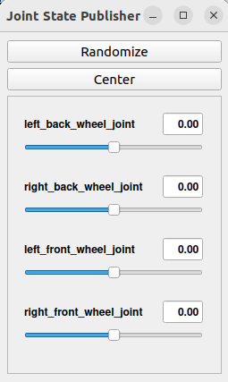
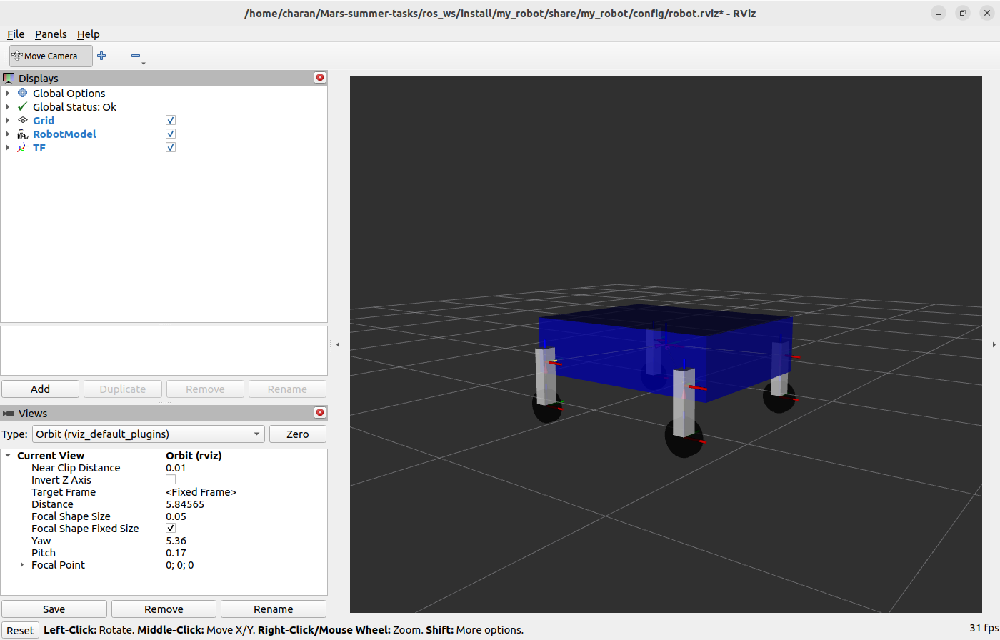
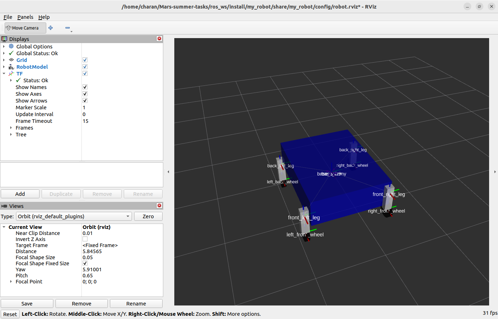

# Visualisation of Robot using RViz

- To visualise it first run this command
```
ros2 launch urdf_tutorial display.launch.py \
  model:=<lacation_of_urdf_file>       		# Change this with the location of your urdf file.
```

- This will open RViz window with our robot design. 
- Now save this in the config directory of the directory `ros_ws/src/my_robot` with the name `robot.rviz` strictly.

## Using launch File:

- From now you can open this with our launch file. 

- Lets see our launch file [rviz.launch.py](../ros_ws/src/my_robot/launch/rviz.launch.py)

- Initally we use processing of xacro but we are not using xacro in the urdf. It is so that if you use xacro you can just change the file name and process it easyly.

### Robot State Publisher
- First we use robot state publisher: a node and a class to publish the state of a robot to tf2.
- At startup time, Robot State Publisher is supplied with a kinematic tree model (URDF) of the robot. It then subscribes to the joint_states topic (of type sensor_msgs/msg/JointState) to get individual joint states. These joint states are used to update the kinematic tree model, and the resulting 3D poses are then published to tf2.
- Robot State Publisher deals with two different "classes" of joint types: fixed and movable.
  - Fixed joints are published to the transient_local /tf_static topic once on startup.
  - Movable joints are published to the regular /tf topic any time the appropriate joint is updated in the joint_states message.

- By default, the robot description must be provided via the robot_description parameter. The robot description is basically the code in the urdf file. 

- More about [Robot State Publisher](https://github.com/ros/robot_state_publisher/tree/rolling)

### Joint State Publisher

- The joint_state_publisher reads the robot_description parameter from the parameter server, finds all of the non-fixed joints and publishes a JointState message with all those joints defined.

- Visualize in RViz and with the help of the joint_state_publisher_gui, configure your robot model by adjusting joint states and poses using the slider.

- It looks like this when you launch 


### RViz 

- It is to visualize a robot’s sensor data, operational state, and virtual surroundings in real-time.

- We run this using 

```ros2 run rviz2 rviz2 -d <urdf_path>
```

- In launch file we use this

```
rviz = Node(
        package='rviz2',
        executable='rviz2',
        arguments=['-d', os.path.join(pkg_path, 'config', 'robot.rviz')],
        output='screen'
)
```

## This is how the visualisation of the Rover looks like 







## References

[ROS 2 Interoperability](https://gazebosim.org/docs/fortress/ros2_interop/) || [[Robot State Publisher](https://github.com/ros/robot_state_publisher/tree/rolling) || [RViz User Guide](https://docs.ros.org/en/humble/Tutorials/Intermediate/RViz/RViz-User-Guide/RViz-User-Guide.html)
