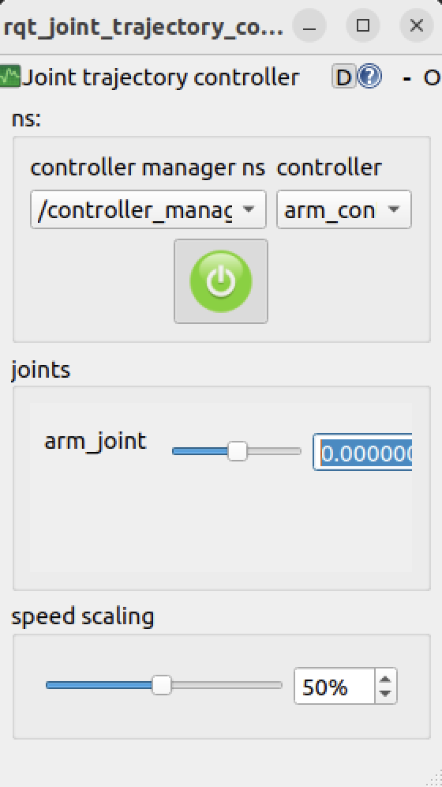

# Task-4

- I have implemented the Lidar sensor and imu sensor, camera and a robot arm on the robot.

## Sensors

- Lidar: an active remote sensing technology that uses pulsating lasers to measure distances and create highly accurate 3D models of environments.
- IMU: It tracks a robot’s 3D motion by measuring angular velocity, linear acceleration, and orientation.
- Camera: It is a optical sensor that captures images or videos of the environment.

- The detailed explanation for all the sensors is in the [sensors.md](sensors.md) file.

- I have implemented a 2D Lidar.

## Arm

- I have implemented a arm which can rotate on y axis between -90 to 90 degrees.
- It has a camera attached to it.

- The detailed explaination about the arm is given in the [robot_arm.md](robot_arm.md) file.

## Bridging the data

- We use ros_gz_bridge to bridge the data from the Gazebo simulator to ROS 2 topics.

- I have explained what plugins and topics are used in their respective markdown files.

- We can see the sensor data in rviz.

## Arm Controller

- We can control the arm using rqt.

- We use ros2_control to control the arm.

- `rqt_joint_trajectory_controller` is a GUI tool that provides a simple interface for controlling the robot arm.

- The detailed explaination of Arm controller is given in the [robot_arm.md](robot_arm.md) file.

- Use the following command

`ros2 run rqt_joint_trajectory_controller rqt_joint_trajectory_controller`

For the arm to sync with the controller, gazebo and rviz, we use the `use_sim_time` parameter. It will make sure the controller, gazebo and rviz are in sync with the time and give the correct camera angle. It was written in the launch files as parameters.

## Running the code

- First build the workspace

`colcon build --symlink-install`

- Source the workspace

`source install/setup.bash`

- Run the gazebo launch file

`ros2 launch my_robot gazebo.launch.py`

- Run the rviz launch file

`ros2 launch my_robot rviz.gazebo.launch.py use_sim_time:=true`

- You can see the sensor data in rviz by adding the topics. We add the Lidar topic as LaserScan and the Camera topic as Image in the display section. After adding LaserScan or Camera we need to write the topic name.

- Use teleop command to drive the robot

`ros2 run teleop_twist_keyboard teleop_twist_keyboard`

- Use `ros2 run rqt_joint_trajectory_controller rqt_joint_trajectory_controller` to control the arm.
