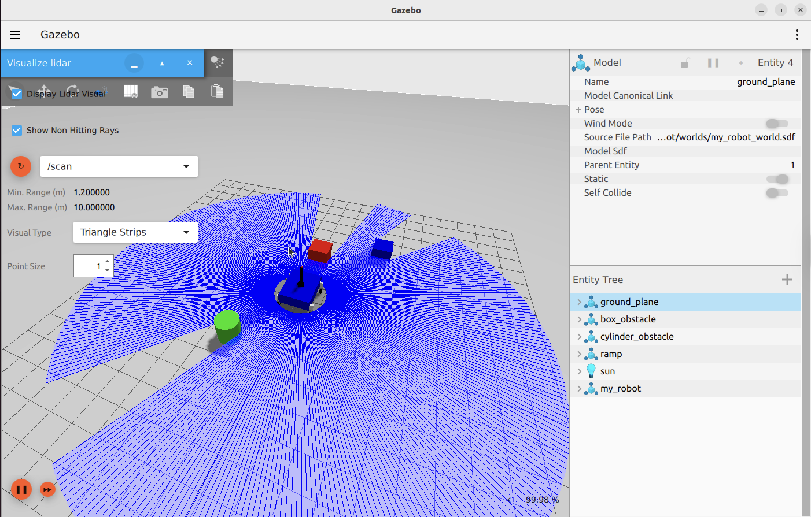
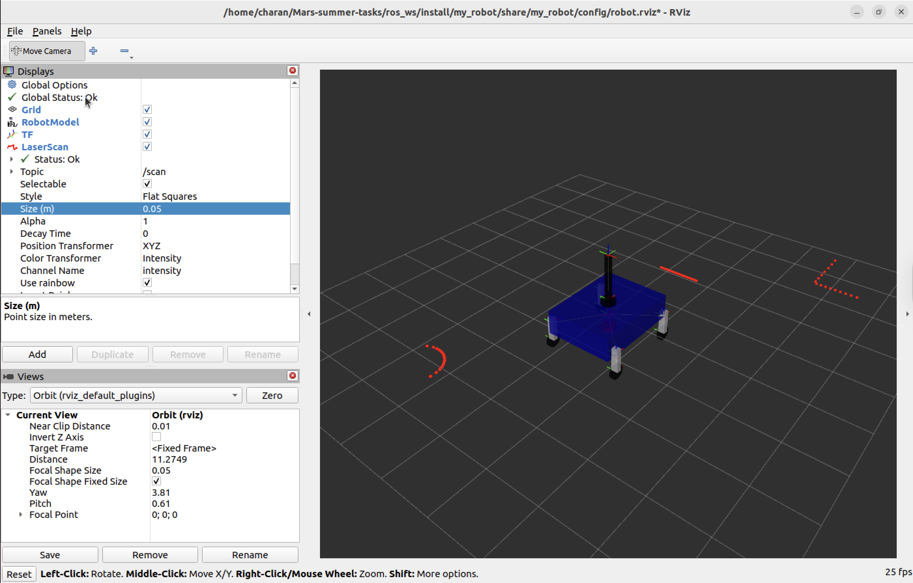
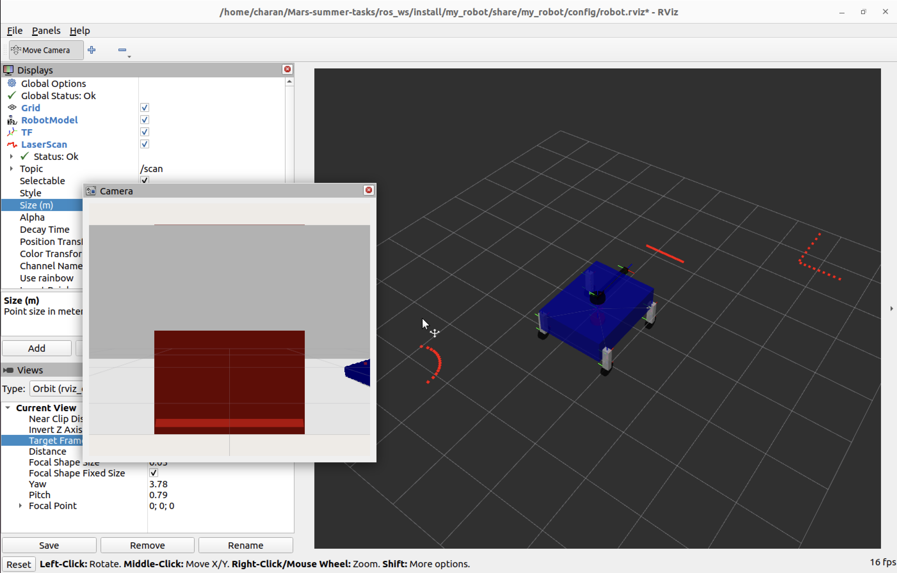
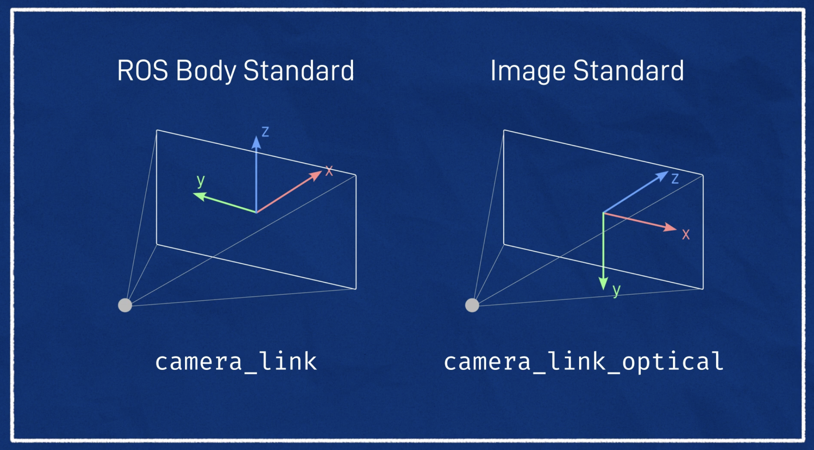

# Sensors and Camera

- I have implemented sensors for obstacle detection and navigation. The sensors include: Lidar and IMU.
- I have implemented a camera too.
- I have set proper bridges to get all the sensor data from Gazebo to ROS 2 topics.

## Lidar

- A lidar is an active remote sensing technology that uses pulsating lasers to measure distances and create highly accurate 3D models of environments.
- I have implemented a 2D Lidar here. It Scans a flat plane. It measures the distance of objects along a single plane and calculates the angles, creating a 2D profile map.

### Code

- We have written the code of the Lidar sensor in `~/Mars-summer-tasks/ros_ws/src/my_robot/urdf/sensors.xacro`.
- First we have created a joint between `base_link` and `lidar_frame`. The type of joint is fixed.
- Then we created a link for the lidar_frame which is a cylinder and have the same dimensions as the wheel.
- It was attaced to the chassis bottom so that it can detect the objects which are of low height.
- Next we can see the sensor implementation using gazebo tag. Which is for the simulation purpose in the Gazebo simulatior.

```
<gazebo reference="lidar_frame">
        <sensor name="lidar_sensor" type="gpu_lidar">
            <pose>0 0 0 0 0 0</pose>
            <visualize>true</visualize>
            <topic>/scan</topic>
            <ignition_frame_id>lidar_frame</ignition_frame_id>
            <update_rate>10</update_rate>
            <always_on>1</always_on>
            <ray>
                <scan>
                    <horizontal>
                        <samples>360</samples>
                        <min_angle>-3.14</min_angle>
                        <max_angle>3.14</max_angle>
                        <resolution>1</resolution>
                    </horizontal>
                </scan>
                <range>
                    <min>1.2</min>
                    <max>10</max>
                    <resolution>0.01</resolution>
                </range>
            </ray>
        </sensor>
</gazebo>
```

This code implements a Lidar sensor for the My Robot in Gazebo.

- The sensor we used is [gpu_lidar](https://gazebosim.org/api/sensors/9/classgz_1_1sensors_1_1GpuLidarSensor.html)

- We bridge the data from the sensor to ROS 2 topics using the `ros_gz_bridge` package.

- We send the data to the /scan topic.

- We select the range to be 1.2-10 because thats the range which is right to detect obstacles avoiding the robot parts as obstacles. If we reduse the min range the legs of the robot will be detected as obstacles.

- The plugin required for lidar is written in the `my_robot_world.sdf` file.

```
<plugin filename="libignition-gazebo-sensors-system.so" 
        name="ignition::gazebo::systems::Sensors">
    <render_engine>ogre</render_engine>
</plugin>
```





## IMU sensor

- It racks a robot’s 3D motion by measuring angular velocity, linear acceleration, and orientation.

- I have implemented imu sensor at the center of the chassis as it is the center of the rover.

### Code

- We have written the code of the IMU sensor in `~/Mars-summer-tasks/ros_ws/src/my_robot/urdf/sensors.xacro`.
- First I have created a link for the imu_frame which has no shape but i have given some mass to it. I haven't given any shape because it sits inside the chasis.
- Then I have created a joint between `base_link` and `imu_frame`. The type of joint is fixed.
- Next we can see the sensor implementation using gazebo tag. Which is for the simulation purpose in the Gazebo simulatior.

```
<gazebo reference="imu_link">
        <sensor name="imu_sensor" type="imu">
            <always_on>1</always_on>
            <update_rate>10</update_rate>
            <visualize>true</visualize>
            <topic>/imu/data</topic>
            <ignition_frame_id>imu_link</ignition_frame_id>
            <plugin filename="libignition-gazebo-imu-system.so" 
                    name="ignition::gazebo::systems::Imu">
            </plugin>
        </sensor>
</gazebo>
```

- This is the code implementaion for the [imu_sensor](https://gazebosim.org/api/sensors/9/classgz_1_1sensors_1_1ImuSensor.html).
- I have used [ros_gz_bridge](https://github.com/gazebosim/ros_gz) to bridge the data from the sensor to ROS 2 topics.
- We send the data to the `/imu/data` topic.
- I have used `ignition::gazebo::systems::Imu` plugin to implement the imu sensor.

## Camera

- A camera is an optical sensor that captures images or videos of the environment.

- I have implemented camera sensor on the single joint arm.



### Code

- We have written the code of the camera sensor in `~/Mars-summer-tasks/ros_ws/src/my_robot/urdf/camera.xacro`.
- First I have created a joint between `arm_link` and `camera_frame`. The type of joint is fixed.
- Then I have created a link for the camera_frame which is a cylinder of radius 0.05 and lenght 0.01.
- Here we have to imiplement a camera_optical_frame to resove the conflict between standard robot coordinate systems and standard computer vision coordinate system.



- Next we can see the sensor implementation using gazebo tag. Which is for the simulation purpose in the Gazebo simulatior.

```
<gazebo reference="camera_frame">
        <sensor name="camera_sensor" type="camera">
            <pose>0 0 0 0 -1.57079632679 0</pose>
            <visualize>true</visualize>
            <update_rate>10</update_rate>
            <always_on>1</always_on>
            <topic>/camera/image_raw</topic>
            <ignition_frame_id>camera_optical_frame</ignition_frame_id>
            <camera>
                <horizontal_fov>1.089</horizontal_fov>
                <image>
                    <format>R8G8B8</format>
                    <width>640</width>
                    <height>480</height>
                </image>
                <clip>
                    <near>0.05</near>
                    <far>8.0</far>
                </clip>
            </camera>
        </sensor>
        <plugin name="camera_controller" filename="libgazebo_ros_camera_plugin.so">
            <frame_name>camera_optical_frame</frame_name>
        </plugin>
    </gazebo>
```

- This is the code implementaion for the camera sensor.

- The sensor we used is [camera](https://gazebosim.org/api/sensors/9/classgz_1_1sensors_1_1CameraSensor.html)

- We bridge the data from the sensor to ROS 2 topics using the `ros_gz_bridge` package.

- We send the data to the `/camera/image_raw` topic.

- I have used `libgazebo_ros_camera_plugin.so` plugin to implement the camera sensor.


## References

[Gazebo plugins in ROS](https://classic.gazebosim.org/tutorials?tut=ros_gzplugins#RunningtheRRBotExample17) || [Adding Lidar](https://articulatedrobotics.xyz/tutorials/mobile-robot/hardware/lidar) || [Adding a Camera](https://articulatedrobotics.xyz/tutorials/mobile-robot/hardware/camera) || [Depth Camera](https://www.youtube.com/watch?v=T9xZ22i9-Ys)
